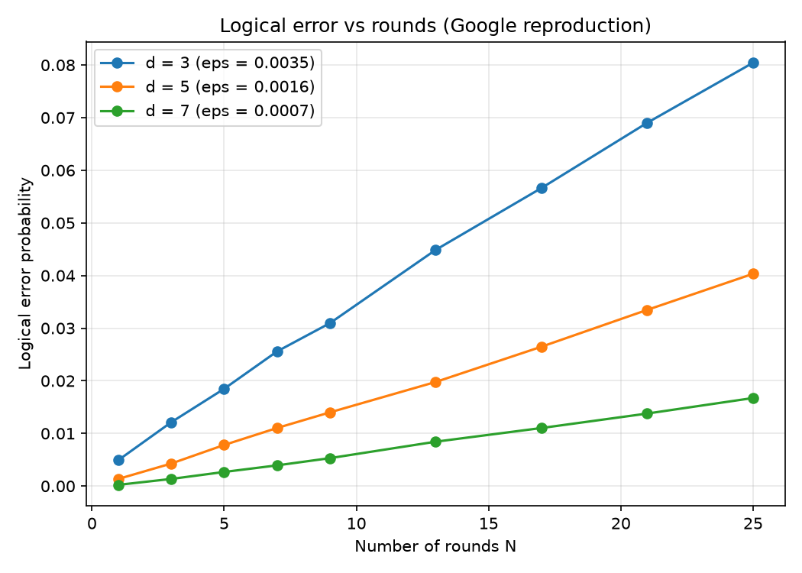
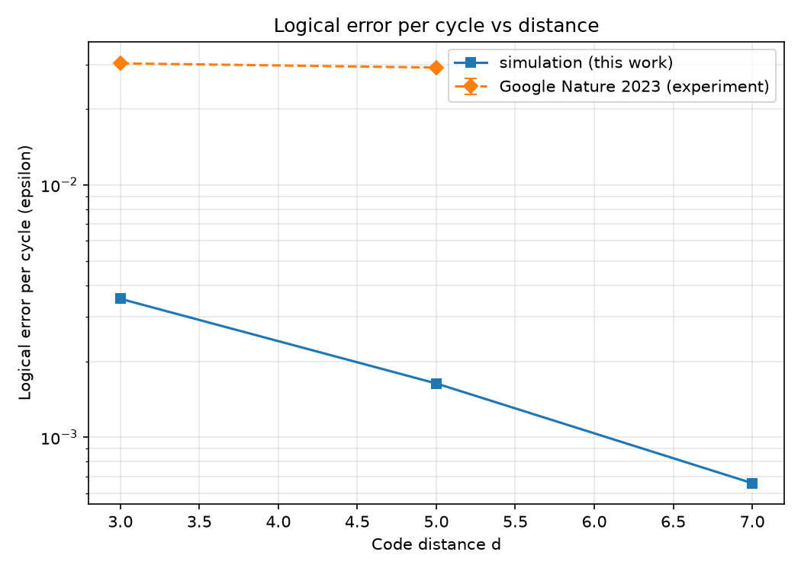

# Google Surface-Code Reproduction

A **simulation** reproduction of Google Quantum AI's 2023 result
*Suppressing quantum errors by scaling a surface code logical qubit* (Nature 614:676-681). It
reproduces the experiment's methodology and central scaling claim: below threshold, increasing the
code distance suppresses the logical error per cycle.

This is repo 6 (capstone A) of a ten-part [QEC research portfolio](https://github.com/afogelis/qec-portfolio) and builds on
[`surface-code-simulator`](https://github.com/afogelis/surface-code-simulator).

## What is and is not reproduced

- **Reproduced:** the extraction of *logical error per cycle* (epsilon) from logical-fidelity decay
  with the number of rounds, and the qualitative scaling -- larger distance, smaller epsilon
  (suppression factor Lambda > 1) -- plus the near-threshold regime where the improvement is modest.
- **Not reproduced:** the device-specific absolute error rates. A single uniform circuit-level
  depolarizing model is used, not Google's calibrated per-component noise, so the published
  values (~3.0% per cycle) are shown for context only, not as a target to hit.

A full hardware reproduction is not possible without the device, so the scope is limited to
reproducing the *analysis and the physics conclusion*.

## Scope

- Reading an experimental paper and re-deriving its key quantity in simulation.
- Methodology: fitting epsilon from fidelity decay, computing the Lambda suppression factor.
- Explicit statement of the boundary between what simulation can and cannot reproduce.

## Install and run

```bash
pip install -e ".[dev]"
pytest
grepro --p 0.004 --shots 40000     # writes figures/ and reports/TECHNICAL_REPORT.md
```

## Results



*Logical error versus number of rounds. The per-cycle logical error epsilon is fit from each decay curve.*



*Simulated logical error per cycle versus distance (this work), with the published experimental values shown for context. Below threshold, epsilon falls with distance (Lambda ~ 2.2).*

Full write-up: [`reports/TECHNICAL_REPORT.md`](reports/TECHNICAL_REPORT.md) — results table, Lambda factors, caveats and references.

## Method (one paragraph)

Logical error per cycle is extracted by fitting `1 - 2 p_fail(N) = (1 - 2 epsilon)^N` over round
counts `N`, with `p_fail(N)` measured by Stim + MWPM via the companion simulator. Running distances
3, 5 and 7 below threshold yields the suppression factor `Lambda = epsilon(d)/epsilon(d+2)`.

## References

- Google Quantum AI. Suppressing quantum errors by scaling a surface code logical qubit. Nature 2023; 614:676-681.
- Fowler AG, Mariantoni M, Martinis JM, Cleland AN. Surface codes: Towards practical large-scale quantum computation. Physical Review A 2012; 86:032324.

## License

MIT — see [LICENSE](LICENSE).
